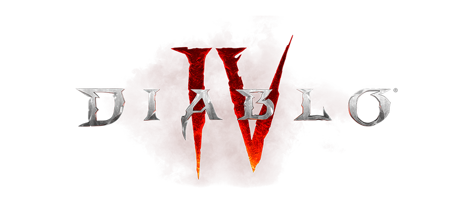

<!-- PROJECT LOGO -->
<br />
<p align="center">
  <a href="https://github.com/Voiidv2/d4countdown">
    
  </a>
  <h3 align="center">Diablo IV Countdown</h3>
  <p align="center">
    A Countdown to the release of Diablo IV
    <br />
    <br />
  </p>
</p>

<!-- ABOUT THE PROJECT -->

## About The Project


A simple countdown created to display the remaining time left until the release of Blizzard's Diablo IV.

### Built With

- [Bootstrap](https://getbootstrap.com/)
- [React](https://reactjs.org/)

<!-- GETTING STARTED -->

## Getting Started

To get a local copy up and running follow these simple steps.

### Prerequisites

This is an example of how to list things you need to use the software and how to install them.

- npm

  ```sh
  npm install npm@latest -g
  ```

### Installation

1. Clone the repo
   ```sh
   git clone https://github.com/Voiidv2/d4countdown.git
   ```
2. Install NPM packages
   ```sh
   npm install
   ```

<!-- ACKNOWLEDGEMENTS -->

## Acknowledgements

- [react-spring](https://react-spring.io/)
